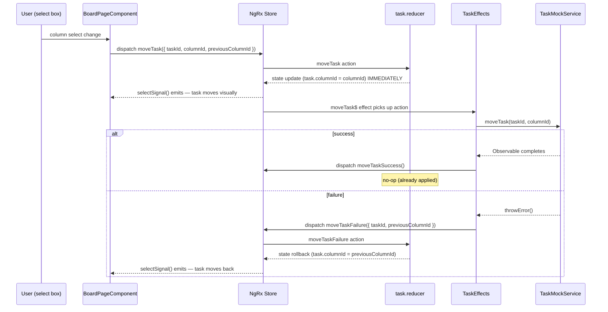

# Phase 6: CI/CD, Deployment, and Documentation - Research

**Researched:** 2026-03-13
**Domain:** GitHub Actions CI/CD, Vercel deployment, technical documentation for a senior engineering interview submission
**Confidence:** HIGH

---

<phase_requirements>
## Phase Requirements

| ID | Description | Research Support |
|----|-------------|-----------------|
| DOC-01 | `README.md` with setup instructions (`npm install && ng serve`) | README must be completely rewritten — current file is the exercise brief, not the project README |
| DOC-02 | README architecture decisions section with rationale for each key choice | Documented decisions in STATE.md, REQUIREMENTS.md, and SUMMARY files drive this content |
| DOC-03 | README scalability considerations (multi-board, real-time, undo/redo, offline) | Exercise spec explicitly calls these out — content is driven by requirements |
| DOC-04 | README AI usage disclosure (transparent, per exercise requirements) | Exercise brief explicitly requires transparency; GSD framework is the correct framing |
| DOC-05 | README explanation of Conventional Commits and why they are valuable | commitlint + husky already enforced; rationale is well-established in the ecosystem |
| DOC-06 | Store structure document (folder organisation + rationale) | `src/app/core/store/` is fully implemented — document reflects actual structure |
| DOC-07 | Interview talking points notes (separate file, structured by evaluation area) | Maps to exercise evaluation criteria table; structured around state management, signals, dynamic rendering, architecture, code quality |
| DOC-08 | GSD framework notes — why it was a good choice for planning this exercise | Meta-documentation about the planning approach used for this exercise |
| DOC-09 | Data flow diagram for task column transition (Mermaid or ASCII) | Shows action → reducer → effect → component chain for `moveTask` optimistic update |
</phase_requirements>

---

## Summary

Phase 6 is overwhelmingly a documentation and deployment phase — the CI pipeline already exists (`.github/workflows/ci.yml` was completed in Phase 5 Plan 03). The actual remaining work divides into three streams: (1) deploying to Vercel by connecting the GitHub repo and configuring a Vercel project, (2) completely replacing the current `README.md` (which is the exercise brief, not a project README) with a comprehensive project README, and (3) writing five separate documentation files covering store structure, interview talking points, GSD framework notes, and a data flow diagram.

The CI workflow (`lint-and-test → build → e2e`) is fully operational. Vercel deployment requires connecting the GitHub repository through Vercel's web UI or CLI, configuring the build output directory (`dist/petello/browser`), and optionally adding a Vercel deploy step to the CI workflow so merges to main trigger automatic deploys. The key constraint is that Vercel's free tier supports Angular SPA deployments without any server-side requirements since this is a purely client-side app.

The documentation scope is significant but fully driven by content that already exists in the codebase and planning files: every architectural decision is already recorded in `STATE.md` summaries, the store structure is fully implemented, and the exercise evaluation criteria table defines exactly what interview talking points to address.

**Primary recommendation:** Organise as three plans — (1) Vercel deployment setup, (2) README rewrite (which is the most important deliverable), (3) supplementary docs (store structure, talking points, GSD notes, data flow diagram). Commit each plan atomically.

---

## What Already Exists (Do Not Rebuild)

| Item | Status | Location |
|------|--------|----------|
| GitHub Actions CI workflow | DONE | `.github/workflows/ci.yml` |
| 3-job pipeline (lint-and-test → build → e2e) | DONE | Phase 5 Plan 03 |
| npm scripts (test, build, format:check, e2e, storybook) | DONE | `package.json` |
| Existing docs (accessibility, dynamic-widget, signal-model) | DONE | `docs/` directory |
| Angular app build output | DONE | `dist/petello/browser/` |

**The CI pipeline is complete.** Phase 6 does NOT need to build CI from scratch. It may optionally extend it with a Vercel deploy step.

---

## Standard Stack

### Core for This Phase

| Tool | Version | Purpose | Notes |
|------|---------|---------|-------|
| Vercel CLI | latest | Deploy Angular SPA to Vercel | Free tier; `npm i -g vercel` or use web UI |
| Mermaid | N/A (Markdown syntax) | Data flow diagrams in Markdown | GitHub renders Mermaid in `.md` files natively |
| GitHub Actions | existing | CI already done; optional deploy step addition | `actions/checkout@v4` already in use |

### Vercel Configuration for Angular

Angular builds to `dist/petello/browser/` (not `dist/petello/` — the `/browser` subdirectory is the SPA root for Angular 17+ with the new `@angular/build` builder). Vercel needs to know:

- **Framework preset:** Angular (Vercel auto-detects via `@angular/cli` in devDependencies)
- **Build command:** `npm run build` (`ng build`)
- **Output directory:** `dist/petello/browser`
- **Install command:** `npm ci --legacy-peer-deps` (REQUIRED — Storybook 10 peer dep conflicts mean plain `npm ci` fails)

**Critical:** The `--legacy-peer-deps` flag must be configured in Vercel's install command setting. Vercel auto-detects Angular but uses `npm ci` by default, which will fail this project.

### Vercel SPA Routing (Rewrites Rule)

Angular is a SPA — all routes must resolve to `index.html` on the server side. Vercel handles this with a `vercel.json` rewrite rule:

```json
{
  "rewrites": [{ "source": "/(.*)", "destination": "/index.html" }]
}
```

Without this, navigating directly to `/board` will 404 on Vercel. Since the app currently uses a single route (`/board`), this is technically optional but is standard practice and prevents surprises.

**Confidence:** HIGH — verified against Vercel Angular deployment docs pattern (standard SPA rewrite).

### Optional: Vercel GitHub Actions Deploy Step

The CI workflow can be extended with a deploy step after E2E passes. This requires:
1. `VERCEL_TOKEN`, `VERCEL_ORG_ID`, `VERCEL_PROJECT_ID` as GitHub Actions secrets
2. Using `vercel --prod` CLI in a deploy job

This is optional — Vercel's GitHub integration (automatic deploys on push to main) provides the same result without CI changes. The simpler path is Vercel's GitHub integration.

---

## Architecture Patterns

### Documentation File Structure

```
docs/
├── accessibility-color-independence.md  (EXISTS — phase 3 design decision)
├── dynamic-widget-outlet-directive.md   (EXISTS — phase 4 architecture doc)
├── signal-model-reasoning.md           (EXISTS — phase 3 design decision)
├── store-structure.md                  (NEW — DOC-06)
├── interview-talking-points.md         (NEW — DOC-07)
├── gsd-framework-notes.md              (NEW — DOC-08)
└── data-flow-diagram.md                (NEW — DOC-09)
```

The existing docs establish a pattern: these files are concise, decision-focused, written for a technical audience. New docs should match that style.

### README Structure (DOC-01 through DOC-05)

The current `README.md` is the exercise brief — it must be completely replaced. The new README is the first thing the interviewer sees and is the most important deliverable of this phase.

Recommended structure:

```markdown
# Petello — Task Board Application

## Quick Start            ← DOC-01
## Architecture Decisions ← DOC-02
## Scalability Notes      ← DOC-03
## AI Usage Disclosure    ← DOC-04
## Conventional Commits   ← DOC-05
## Live Demo              ← Vercel URL
## Tech Stack
## Project Structure
```

### Content Guidance for Each DOC Requirement

**DOC-02 — Architecture Decisions (README section)**

Key decisions to document (sourced from `STATE.md` accumulated context):
- Angular 21 (not 17 per spec) — reasoning: user preference, still meets intent, signals/new file naming
- NGRX with EntityAdapter — normalised store, O(1) lookups, devtools support
- Optimistic `moveTask` with `previousColumnId` in payload — rollback without selector call in effects
- `concatMap` for mutation effects — prevents request cancellation/reordering
- `signal()` over `model()` for `isExpanded`/`isEditMode` — no parent two-way binding needed
- `store.selectSignal()` bridge in smart components — single source of truth, reactive without manual subscriptions
- Smart/dumb component split — `BoardPageComponent` (smart) passes signal values down via `input()` to presentational components
- `DynamicWidgetOutletDirective` with `untracked()` in config effect — avoids Angular 21 NG0602 prohibition on nested `effect()` in reactive context
- Vitest via `@analogjs/vitest-angular` — Jest-compatible API, faster than Karma
- Storybook 10 (not 8) — Angular <22 support, `@angular-devkit/build-angular` peer dep required
- `npm ci --legacy-peer-deps` everywhere — Storybook 10 peer dep conflicts with Angular 21
- Select box for column moves (not DnD) — spec approved, focuses review on state management

**DOC-03 — Scalability Considerations (README section)**

The exercise spec explicitly lists these four scenarios — address each directly:
1. **Multiple boards** — board ID would key store slices; `selectTasksByColumn` factory selector pattern already parameterised; router param → board ID → `loadTasks` dispatch
2. **Real-time collaboration** — WebSocket effect alongside HTTP effect; `moveTask` could arrive from server pushing `moveTaskSuccess` directly; conflict resolution via last-write-wins or OT
3. **Undo/redo** — NGRX action history pattern; `moveTask` carries `previousColumnId` already (designed with undo in mind); could wrap store with an undo stack reducer
4. **Offline support** — optimistic updates already in place; service worker + action queue; `shouldFail` seam in mock service shows the rollback path already exists

**DOC-04 — AI Usage Disclosure (README section)**

The exercise brief explicitly requires transparency. Key facts to disclose:
- Used Claude via the GSD (Get-Shit-Done) structured planning framework
- GSD produced a phased roadmap (6 phases), research docs, and task-level plans
- All implementation code was AI-generated but reviewed and understood by the developer
- The candidate can walk through every architectural decision (the interview expectation)
- GSD framework notes are in `docs/gsd-framework-notes.md` for deeper context
- This is exactly the "AI as force multiplier" use case the exercise brief endorses

**DOC-05 — Conventional Commits (README section)**

Content points:
- Enforced via `commitlint` + `husky` `commit-msg` hook
- Format: `type(scope): description` — e.g., `feat(store): add moveTask optimistic update`
- Types: feat, fix, chore, docs, test, refactor, perf, ci, style, build
- Value: machine-readable history enables automated changelogs, semantic versioning, clear PR reviews, and self-documenting codebase evolution
- Configuration: `commitlint.config.js` extends `@commitlint/config-conventional`
- Node version note: `commit-msg` hook sources nvm to ensure Node 23 for commitlint

**DOC-06 — Store Structure Document**

Actual folder structure to document:
```
src/app/core/store/
├── actions/
│   └── task.actions.ts       — 15 action creators (5 commands + 10 events)
├── effects/
│   └── task.effects.ts       — loadTasks$, addTask$, moveTask$, updateTask$, removeTask$
├── reducers/
│   └── task.reducer.ts       — createFeature with EntityAdapter, optimistic moveTask
├── selectors/
│   └── task.selectors.ts     — selectTasksByColumn (factory), selectCountByPriority, selectCompletionRate
└── index.ts                  — barrel: exports TaskEffects (named, prevents internals leak)
```

Key rationale points: EntityAdapter gives normalised O(1) CRUD; `createFeature` auto-generates feature selector; named barrel export prevents `@ngrx/effects` internals bleeding through; factory selectors over deprecated `props` pattern.

**DOC-07 — Interview Talking Points**

Structure by the exercise evaluation criteria table:
1. **State Management** — EntityAdapter, optimistic update pattern, `previousColumnId` rollback, concatMap safety
2. **Signals Usage** — `input()` signals, computed signals chain (priority CSS → date format → overdue), `store.selectSignal()` bridge, why `signal()` not `model()` for local state
3. **Dynamic Rendering** — `ViewContainerRef.createComponent()`, `ComponentRef.setInput()`, `untracked()` workaround for NG0602, `DestroyRef` cleanup
4. **Architecture** — Smart/dumb split, `core/` vs `features/` vs `shared/` organisation, why `concatMap` not `switchMap` for mutations
5. **Code Quality** — Discriminated union `_exhaustiveCheck`, `export type` for `isolatedModules`, `inject()` before `createEffect()` for DI safety

**DOC-08 — GSD Framework Notes**

Content: GSD is a structured AI planning framework that externalises intent (CONTEXT.md), researches the domain (RESEARCH.md), and produces task-level execution plans (PLAN.md). For this exercise it prevented scope creep, created a verifiable paper trail of every decision, and produced a 6-phase roadmap that matched the natural dependency chain of an Angular application. The framework makes AI assistance transparent and auditable — exactly what the exercise brief asked for.

**DOC-09 — Data Flow Diagram**

The `moveTask` optimistic update is the most interview-worthy flow. Use Mermaid (GitHub renders it natively):



---

## Don't Hand-Roll

| Problem | Don't Build | Use Instead | Why |
|---------|-------------|-------------|-----|
| SPA routing on Vercel | Custom server config | `vercel.json` rewrite rule | One JSON line handles all routes |
| Vercel deploy in CI | Custom curl/API calls | Vercel GitHub integration or `vercel` CLI | Native integration handles preview/prod logic |
| Mermaid diagrams | ASCII art flow charts | Mermaid in Markdown | GitHub renders Mermaid natively; much easier to maintain |
| README from scratch | Generic template | Interview-spec-driven structure | Each section maps to a DOC requirement |

---

## Common Pitfalls

### Pitfall 1: Vercel Install Command Not Overridden
**What goes wrong:** Vercel uses `npm ci` by default. This project requires `npm ci --legacy-peer-deps` due to Storybook 10 peer dep conflicts with Angular 21. Vercel build will fail on the install step.
**How to avoid:** In Vercel project settings, override Install Command to `npm ci --legacy-peer-deps`.
**Warning signs:** Build log shows `npm ERR! ERESOLVE` or peer dependency conflict errors.

### Pitfall 2: Wrong Output Directory
**What goes wrong:** Angular 17+ with `@angular/build` outputs to `dist/petello/browser/` — not `dist/petello/`. Vercel may auto-detect `dist/petello/` (one level up) which contains the `browser/` folder plus server build artifacts.
**How to avoid:** Explicitly set Output Directory to `dist/petello/browser` in Vercel project settings.
**Warning signs:** Vercel deploys but serves a directory listing or 404 instead of the Angular app.

### Pitfall 3: README Replaces Exercise Brief
**What goes wrong:** The current `README.md` IS the exercise brief. Replacing it removes the spec from the repo. The interviewer expects to see both: a project README and the original exercise spec.
**How to avoid:** Rename current `README.md` to `EXERCISE.md` (or similar) before writing the new `README.md`. Or: the exercise brief can stay as `README-angular.md` (already exists as Angular's default README) and the brief can be archived to `EXERCISE.md`.
**Note:** `README-angular.md` already exists (Angular's default scaffold README). The exercise brief is currently `README.md`. Archive to `EXERCISE.md`.

### Pitfall 4: Underestimating README Scope
**What goes wrong:** README with minimal content looks like an afterthought. The exercise has explicit requirements for what the README must contain (DOC-01 through DOC-05) and the interviewer explicitly evaluates the README.
**How to avoid:** Treat the README as a deliverable, not a formality. Each DOC requirement maps to a named section.

### Pitfall 5: Interview Talking Points Too Generic
**What goes wrong:** Generic "I used NGRX for state management" without specifics is forgettable. The interviewer will probe specifics.
**How to avoid:** DOC-07 talking points should reference specific implementation decisions — the `previousColumnId` payload design, the `untracked()` NG0602 fix, the `concatMap` vs `switchMap` choice, the `inject()` before `createEffect()` ordering.

### Pitfall 6: Mermaid Diagram Not GitHub-Compatible
**What goes wrong:** Mermaid syntax errors silently render as code blocks on GitHub rather than diagrams.
**How to avoid:** Use `sequenceDiagram` (most universally supported type). Test with GitHub's Mermaid preview. Keep node labels short and avoid special characters.

---

## Vercel Deployment Decision Tree

```
Is repo public on GitHub?
  YES → Use Vercel GitHub integration (simplest, free tier)
    → vercel.com → New Project → Import Git Repository
    → Configure: Install Command = npm ci --legacy-peer-deps
    → Configure: Output Directory = dist/petello/browser
    → Deploy → get public URL
  NO → Use Vercel CLI: vercel --prod
```

Since this is a take-home exercise submitted via GitHub, the repo should be public. Vercel GitHub integration is the correct path.

---

## Validation Architecture

### Test Framework (Phase 6 — documentation-heavy phase)

| Property | Value |
|----------|-------|
| Framework | Vitest via `ng test --watch=false` |
| Config file | `angular.json` (unit-test builder target) |
| Quick run command | `npm test` |
| Full suite command | `npm test && npm run e2e` |

### Phase Requirements → Test Map

| Req ID | Behavior | Test Type | Automated Command | File Exists? |
|--------|----------|-----------|-------------------|-------------|
| DOC-01 | README exists with setup instructions | smoke/manual | `test -f README.md && grep -q "npm install" README.md` | ❌ Wave 0 (README is exercise brief) |
| DOC-02 | README has architecture decisions section | manual | `grep -q "Architecture" README.md` | ❌ Wave 0 |
| DOC-03 | README has scalability section | manual | `grep -q "Scalab" README.md` | ❌ Wave 0 |
| DOC-04 | README has AI usage section | manual | `grep -q "AI" README.md` | ❌ Wave 0 |
| DOC-05 | README has Conventional Commits section | manual | `grep -q "Conventional Commits" README.md` | ❌ Wave 0 |
| DOC-06 | Store structure doc exists | manual | `test -f docs/store-structure.md` | ❌ Wave 0 |
| DOC-07 | Interview talking points doc exists | manual | `test -f docs/interview-talking-points.md` | ❌ Wave 0 |
| DOC-08 | GSD framework notes doc exists | manual | `test -f docs/gsd-framework-notes.md` | ❌ Wave 0 |
| DOC-09 | Data flow diagram doc exists with Mermaid block | manual | `test -f docs/data-flow-diagram.md` | ❌ Wave 0 |

All DOC requirements are manual-verification — they are content deliverables, not code. The "automated command" column shows shell one-liners that can be used in a verification checklist but do not replace human review.

**Deployment verification** (TOOL-09 partial — deploy step):

| Item | Verification |
|------|-------------|
| Vercel URL accessible | `curl -s -o /dev/null -w "%{http_code}" <VERCEL_URL>` returns 200 |
| SPA routing works | Navigate to `/board` directly — no 404 |
| App loads correctly | `ng serve` locally; Vercel deployment visual check |

### Sampling Rate
- **Per task commit:** Verify file exists and contains expected sections
- **Per wave merge:** All DOC files present, Vercel URL live and accessible
- **Phase gate:** All 9 DOC requirements confirmed before `/gsd:verify-work`

### Wave 0 Gaps
- [ ] `docs/store-structure.md` — covers DOC-06
- [ ] `docs/interview-talking-points.md` — covers DOC-07
- [ ] `docs/gsd-framework-notes.md` — covers DOC-08
- [ ] `docs/data-flow-diagram.md` — covers DOC-09
- [ ] `README.md` — needs complete rewrite (covers DOC-01 through DOC-05); current file is exercise brief
- [ ] `EXERCISE.md` — archive of original exercise brief (prevents loss of spec)
- [ ] `vercel.json` — SPA rewrite rule for Angular routing

---

## Suggested Plan Breakdown

Given the work is primarily writing + one-time Vercel setup, three plans is appropriate:

| Plan | Content | Requirements |
|------|---------|--------------|
| 06-01 | Vercel deployment — `vercel.json`, Vercel project setup, public URL, optional CI deploy step | Supports TOOL-09 (deploy step); enables "live demo" in README |
| 06-02 | README rewrite — archive exercise brief as `EXERCISE.md`, write full project `README.md` | DOC-01, DOC-02, DOC-03, DOC-04, DOC-05 |
| 06-03 | Supplementary docs — store structure, interview talking points, GSD notes, data flow diagram | DOC-06, DOC-07, DOC-08, DOC-09 |

---

## State of the Art

| Old Approach | Current Approach | Impact |
|--------------|-----------------|--------|
| Manual Vercel deploys | Vercel GitHub integration (auto-deploy on push) | Zero config CD once connected |
| `dist/` as output root | `dist/petello/browser/` for Angular 17+ | Must configure in Vercel — easy mistake |
| Mermaid in external tools | Mermaid in `.md` files (GitHub renders natively) | No external tooling needed |
| Generic README template | Interview-spec-driven README sections | Each section maps to a DOC requirement |

---

## Open Questions

1. **Should the CI workflow gain a Vercel deploy step?**
   - What we know: Vercel GitHub integration handles automatic deploys without CI changes
   - What's unclear: Whether a CI-gated deploy (deploy only after E2E passes) is preferred over Vercel's integration
   - Recommendation: Use Vercel GitHub integration for simplicity (free tier, zero secrets management). The CI already validates before merge; Vercel deploys from main which is already protected by CI.

2. **Does the Vercel URL need to be committed or just documented?**
   - What we know: The README should have a "Live Demo" link
   - What's unclear: Whether the URL is known before the README plan runs
   - Recommendation: Do Vercel deployment in Plan 06-01 first. Capture the URL. Reference it in the README (Plan 06-02).

3. **Should `README.md` (exercise brief) be renamed or preserved?**
   - What we know: The exercise says "include a README.md" — so a `README.md` must exist
   - Recommendation: Archive current `README.md` as `EXERCISE.md`. Write new `README.md`. Both files serve a purpose.

---

## Sources

### Primary (HIGH confidence)
- `STATE.md` accumulated context — all architectural decisions for Phases 1-5 (in-repo, current)
- `.github/workflows/ci.yml` — existing CI pipeline (in-repo, current)
- `REQUIREMENTS.md` DOC-01 through DOC-09 — exact requirements text (in-repo, current)
- `README.md` (exercise brief) — exact interviewer expectations for documentation content (in-repo, current)
- Phase 5-03 SUMMARY.md — CI pipeline decisions, Node 23 pin, legacy-peer-deps requirement (in-repo, current)

### Secondary (MEDIUM confidence)
- Vercel SPA rewrite pattern (`vercel.json` rewrites) — standard practice, documented across multiple sources; `dist/petello/browser` output directory is Angular 17+ standard behaviour
- Mermaid GitHub rendering — GitHub has supported Mermaid in Markdown since 2022; sequenceDiagram type is most stable

### Tertiary (LOW confidence)
- Vercel auto-detection of Angular framework — likely works but not verified against this specific package.json; manual override recommended regardless

---

## Metadata

**Confidence breakdown:**
- CI/CD status: HIGH — code is in-repo, inspected directly
- Vercel deployment: MEDIUM — standard patterns, but install command override is a pitfall that needs explicit verification during execution
- Documentation content: HIGH — driven entirely by in-repo decisions and exercise spec requirements
- README scope: HIGH — exercise brief defines exactly what sections are required

**Research date:** 2026-03-13
**Valid until:** 2026-04-13 (stable — Vercel SPA patterns and Angular output paths are stable)
