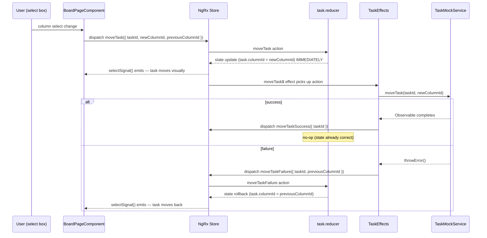
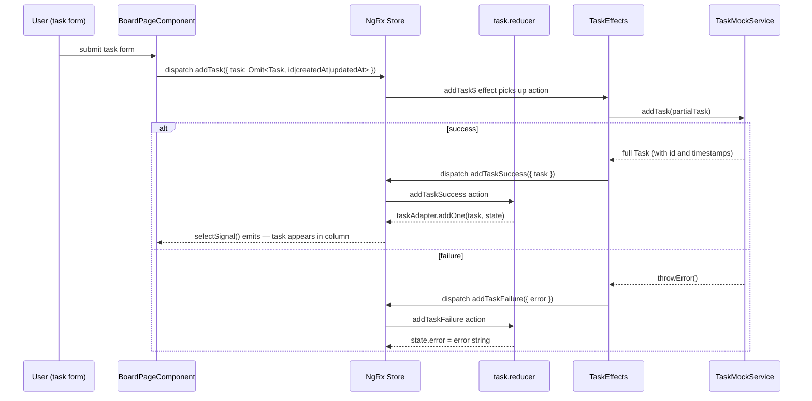

# Data Flow Diagrams

Two sequence diagrams for the most interview-relevant flows in the codebase.

---

## 1. `moveTask` — Optimistic Update with Rollback

This flow is the most architecturally interesting in the codebase. It illustrates optimistic state management, effect coordination, and rollback — three patterns that require careful sequencing to avoid race conditions.

**Why the reducer handles `moveTask` synchronously**

The reducer applies the column change immediately when `moveTask` is dispatched — before the API call completes. This means the user sees the task move with zero latency. The effect runs asynchronously afterward as an eventual-consistency check, not as the primary state writer.

**The `previousColumnId` design**

`moveTask` carries `{ taskId, previousColumnId, newColumnId }`. The `previousColumnId` is captured at dispatch time, when the component knows the current state of the task. On `moveTaskFailure`, the reducer uses it to revert: `taskAdapter.updateOne({ id: taskId, changes: { columnId: previousColumnId } })`. The effect never queries the store for the old column. If it did, there would be a read-after-write window: between the optimistic write and the effect's store query, a concurrent action could have changed the task's column, and the rollback would use stale data. The payload approach eliminates that window.

**The `moveTaskSuccess` no-op**

The reducer handles `moveTaskSuccess` with `on(moveTaskSuccess, (state) => state)` — it returns the state unchanged. The optimistic state is already correct. The event exists to signal "the server confirmed" for DevTools inspection, audit logging, or analytics without requiring any state change.

**Test seam**

The URL parameter `?failNextMove=1` sets `TaskMockService.shouldFail = true` directly. No DI override is needed because the service is `providedIn: 'root'` — the same singleton instance is shared between the app and the Playwright test's page context. The E2E rollback test uses this seam to trigger a controlled failure.

---

## 2. `addTask` — Straightforward Effect (No Optimistic Update)

`addTask` does not use optimistic state because the server assigns `id`, `createdAt`, and `updatedAt`. The client cannot construct a valid `Task` without those fields, so the reducer waits for `addTaskSuccess` before adding the task to the entity store.

This is the contrast case: when the client lacks the data needed to construct the full entity, pessimistic (server-authoritative) state is the correct approach.

